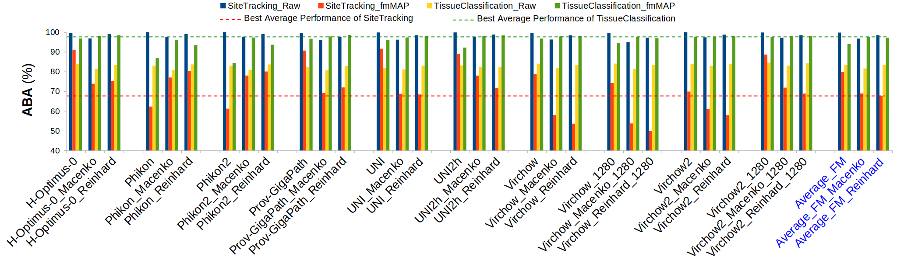

# fmMAP: A Framework Reducing Site-Bias Batch Effect from Foundation Models in Pathology

We propose a Foundation Model-based Manifold Approximation Pipeline (fmMAP) to reduce the batch effect by adjusting features from FMs. Our framework employs supervised uniform manifold approximation (UMAP) to transform features generated by FMs into an optimal space. In this transformed space, characteristics of features of interest (i.e., biological features) are highlighted while other confounding factors are reduced.



## Prerequisites
* Python 3.6 or greater
* numpy
* scipy
* scikit-learn
* numba
* tqdm
* matplotlib

## Foundation Models (FMs)
You can find the tutorials and pretrained FMs at their HuggingFace:
* [UNI-2h](https://huggingface.co/MahmoodLab/UNI2-h)
* [UNI](https://huggingface.co/MahmoodLab/UNI)
* [Virchow](https://huggingface.co/paige-ai/Virchow)
* [Virchow2](https://huggingface.co/paige-ai/Virchow2)
* [H-Optimus-0](https://huggingface.co/bioptimus/H-optimus-0)
* [Prov-GigaPath](https://huggingface.co/prov-gigapath/prov-gigapath)
* [Phikon](https://huggingface.co/owkin/phikon)
* [Phikon-v2](https://huggingface.co/owkin/phikon-v2)

## Notebooks
*

## License
This project is under the CC-BY-NC 4.0 license. See [LICENSE](LICENSE.md) for details.

## Acknowledgments
* Our analysis is based on [UNI](https://github.com/mahmoodlab/UNI) guidelines.
* This code is based on [UMAP](https://github.com/lmcinnes/umap).

## Reference
If you find our work useful, please cite our [paper](./README.md):
```
@article{ho2025,
  title={fmMAP: A Framework Reducing Site-Bias Batch Effect from Foundation Models in Pathology},
  author={Nguyen, Cao Truong Hai and Ho, David Joon},
  year={2025}
}
```
